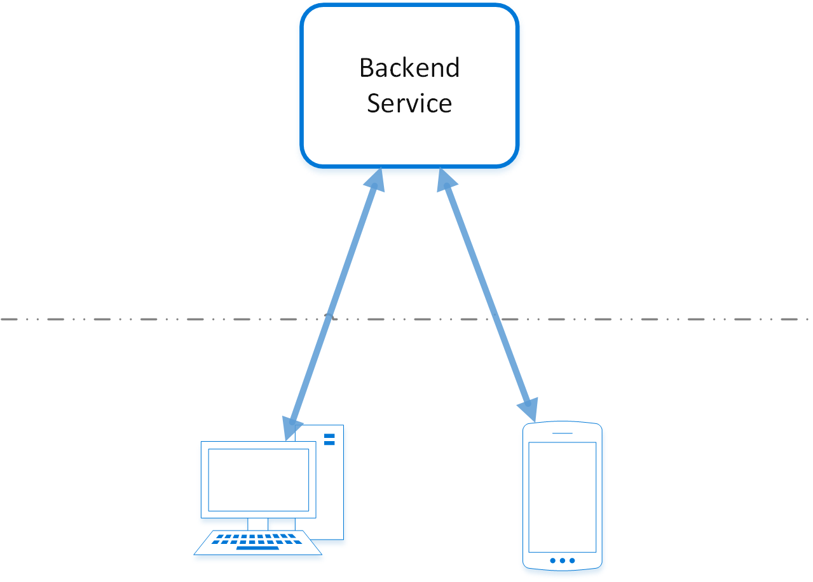

# Backends for Frontends

Use the backends for frontends pattern to develop targeted backend services for use with specific frontend applications or interfaces. This pattern is useful when you wish to avoid implementing customizations for multiple interfaces in a single backend.

## Context and Problem

As an application is developed it may initially be targeted at a desktop web user interface. Typically, a backend service is developed in parallel and provides the features that the desktop web user interface requires. As the application's user base grows, a mobile application is developed that must also interact with the same backend. Originally developed for the desktop web user interface, it becomes a general-purpose backend serving the requirements of both the desktop and mobile interfaces.

The capabilities of a mobile device differ significantly from a desktop web user interface in screen size, performance, and display limitations. As a result, the requirements of the mobile application's backend differ from the desktop web user interface.

These differences result in competing requirements for the backend. The backend requires regular and significant changes such that it can serve both the desktop web user interface and the mobile application. It becomes a focus for development activity from separate interface teams and, ultimately, emerges as a bottleneck in the development process. Conflicting update requirements, and the need to keep the service working for both frontends, can result in lots of effort expended on a single deployable resource.

 

As the development activity focuses around the backend service, a separate team may be created to manage and maintain the backend. Ultimately this results in a disconnect between the interface and backend development teams, reducing developer output at the interface level and placing a burden on the backend team to balance the requirements of the different user interface teams.

## Solution

Use the backends for frontends pattern and create one backend per user interface. This allows you to fine tune the behavior and performance of the backend to best match the needs of your frontend environment, without worrying about affecting other frontend experiences.

 

Since each backend is specific to one interface it can be optimized for that interface, meaning it will be smaller, less complex and likely faster than a generic backend that tries to satisfy requirement for all interfaces.

Each interface team has autonomy to control their own backend and is not reliant on a centralized backend development team to mediate with other interface teams before changes can be made to their backend. This gives the interface team flexibility in language selection, release cadence, prioritization of workload and feature integration in their backend.

## Issues and Considerations

- Consider how many backends for frontends you will deploy.
- If different interfaces (such as mobile clients) will make the same requests, consider whether it is necessary to implement a backend for each interface, or if a single backend will suffice.
- Code duplication across services is highly likely when implementing this pattern.
- Frontend-focused backend services should only contain client-specific logic and behavior. General business logic and other global features should be managed elsewhere in your application.
- Think about how the backend for frontend pattern might be reflected in the responsibilities of a development team.
- Consider how long it will take to implement a backend for frontend pattern. Will the delay in building the new focused backends incur technical debt while continuing to support supporting the existing generic backend?

## When to Use this Pattern

Use this pattern when:

- A shared or general purpose backend service must be maintained with significant development overhead.
- You want to optimize the backend, and have it focused toward the requirements of the specific interface that interacts with it.
- Customizations are made to a general-purpose backend to accommodate multiple interfaces.
- An alternative language is better suited for the backend of a different user interface.

This pattern may not be suitable:

- When interfaces make the same or similar requests to the backend.
- When only one interface is used to interact with the backend.

## Related guidance

Gateway Router Pattern
Gateway Offload Pattern
Gateway Aggregation Pattern

