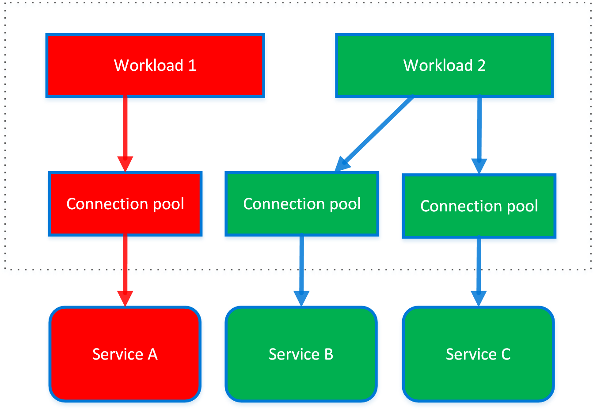
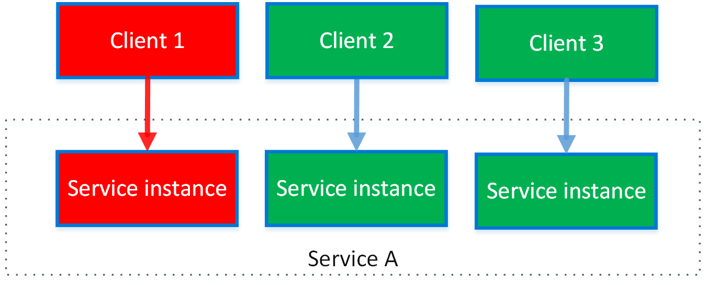

# Bulkhead Pattern

Isolate the elements of an application like the sectioned partitions of a ship's hull. If the hull of a ship that uses bulkheads is compromised, only the damaged section of the ship will fill with water, and the ship will not sink. Using the same concept in application design, this pattern isolates instances of a service or clients into pools so that if one fails, the others will continue to function.

## Context and Problem

An application that is deployed in the cloud may provide multiple consumers and services as part of a complete solution, with each service having one or more reliant consumers. Excessive load or failure in an application or service will impact all consumers of the service.

A consumer may send requests to multiple services simultaneously, using resources for each request. When the consumer sends a request to a service that is misconfigured or not responding, resources used by the client's request may not be freed in a timely manner. As requests to the service continue, the client's resources, like thread pools for instance, are consumed. When the thread pool is exhausted, requests by the consumer to other services are impacted, preventing the consumer from sending requests to other services as well as the original unresponsive service.

The same issue of resource exhaustion affects services with multiple consumers. A large number of requests originating from one client may exhaust available resources in the service. Other reliant consumers are then no longer able to consume the service, causing a cascading failure effect.

## Solution

Isolate failures by implementing the bulkhead pattern. Partition service instances into different groups based on consumer load and availability requirements. This allows you to sustain service functionality for some consumers, even in the event of a failure.

A consumer calling multiple services can also partition resources in order to ensure the resources used to call one service are not affecting the resources used to call another service. For example, a consumer that calls multiple services may be assigned a connection pool for each service being contacted. A service that begins to fault only affects the connection pool assigned to the consumer for that service, allowing the consumer to continue using the other services without issue.

The benefits of implementing this pattern are:

- Isolates consumers and services from cascading failures. An issue affecting a consumer or service can be isolated within its own bulkhead, preventing the entire solution from failing if a single consumer or service goes rogue.
- Allows you to preserve some functionality in the event of a service failure. Other services and features of the application will continue to work, even in the event of a service failure or a consumer exhausting its resources.
- Allows you to deploy services that offer a different quality of service for consuming applications. A high priority consumer pool can be configured to use high priority services. 

 

In the above diagram, bulkheads are structures around thread pools calling individual services. If Service A is failing or causing some other issue, each thread pool is isolated so only workloads using the thread pool assigned to Service A are affected. Workloads that make use of Service B and C are not affected by service A's outage and can continue working without interruption.


     
In this diagram, we see multiple clients making calls to a single service, with each client using a separate service instances to perform calls. Client 1 has made too many requests and has overwhelmed the instance it's calling. Because each service instance is isolated from the other instances, the other clients can continue making calls.

## Issues and considerations

When implementing this pattern, consideration should be given to the following points:

- Define partitions around the business and technical requirements of the application.
- When partitioning services or consumers into bulkheads, consider the level of isolation offered by the technology as well as the overhead in terms of cost, performance and manageability.
- Consider combining bulkheads with retry, circuit breaker, and throttling patterns to provide more sophisticated fault handling.
- When partitioning consumers into bulkheads, consider using processes, thread pools, and semaphores. Projects like Netflix Hystrix or Polly offer a framework for creating consumer bulkheads.
- When partitioning services into bulkheads, consider deploying them into separate virtual machines, containers or processes. Containers offer a good balance of resource isolation with fairly low overhead.
- Services that communicate over asynchronous messages can be isolated through different sets of queues. Each queue may have a dedicated set of instances processing messages on the queue, or a single group of instances using an algorithm to dequeue and dispatch processing.
- Determine the level of granularity for the bulkheads. If for example we wanted to distribute tenants across partitions, we need to decide if we want to place each tenant into a separate partition, a dozen or more.
- Monitor each partition’s performance and SLA.

## When to use this pattern

Use this pattern to:

- Isolate resources used to consume a set of different backend services, especially where the application is able to deliver some functionality when one of the services is not responding.
- Isolate critical consumers from standard consumers.
- Protect the application from cascading failures.

This pattern may not be suitable when:

- Less efficient use of resources may not be acceptable in the project.
- The added complexity is not necessary

## Example

A bulkhead pattern would create a separate container for each isolated service or application. The following Kubernetes YAML code example creates new isolated container to run a single service, with its own CPU and memory resources allocated, and resource limits set: 

```yml
apiVersion: v1
kind: Pod
metadata:
  name: drone-management
spec:
  containers:
  - name: drone-management-container
    image: drone-service
    resources:
      requests:
        memory: "64Mi"
        cpu: "250m"
      limits:
        memory: "128Mi"
        cpu: "1"
```

## Related guidance

Timeouts
Retry Pattern
Circuit Breaker Pattern
Resiliency Guidance
Throttling Pattern
Data Partitioning Guidance

