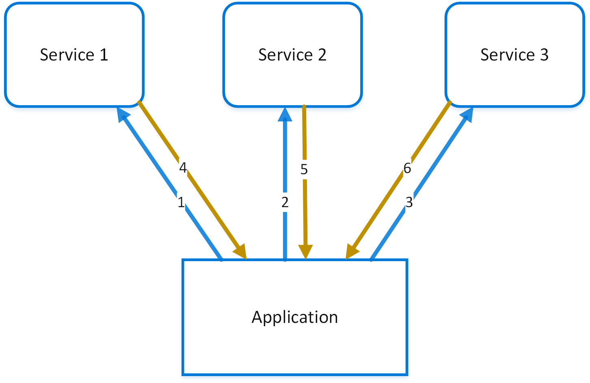
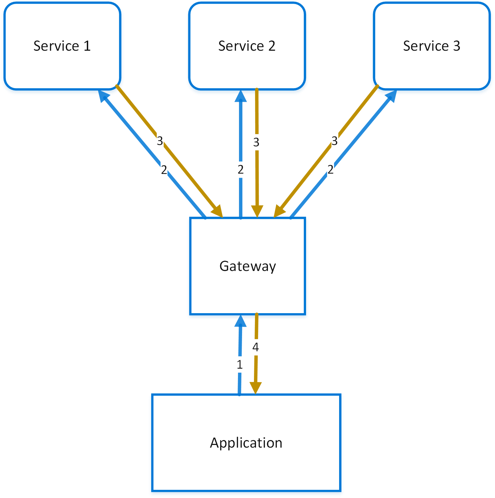

# Gateway Aggregation pattern

Aggregate multiple individual requests to a single request using the gateway aggregation pattern. This pattern is useful when a client must make multiple calls to different backend systems to perform an operation.

## Context and problem

In order to perform a single task, a client may have to make multiple calls to various backend services. An application that relies on many services to perform a task must expend resources on each request to those back-end services. When any new feature or service is added to the application, additional requests are needed, further increasing resource requirements and calls across a network. The increasing use of microservice architectures has made these problems much more common, as applications built around many smaller services naturally have a higher amount of cross-service calls. 

This chattiness between a client and a backend can adversely impact the performance and scale of the application. As an example, a mobile application may make multiple calls over a cellular network during use. Each request requires adequate resources to send the request, receive and process the response.

 

In the diagram above, the application sends individual requests to each service (1,2,3). Each service processes the request and sends the response back to the application (4,5,6). In this example, the application must make three separate requests, and receive three separate responses 

Over a cellular network with typically high latency, using individual requests in this manner is inefficient and could result in broken connectivity or incomplete requests, causing undesirable behavior of the application. While each request may be done in parallel, the application must send, wait and process data for each request, all on separate connections, increasing the possibility of failure.

## Solution

Use the gateway aggregation pattern to reduce chattiness between the client and the services. The gateway is responsible for receiving, processing, and dispatching requests to the various backend systems before aggregating the results and sending them back to the requesting client.

Implementing the gateway aggregation pattern can help in reducing the number of requests being made by an application to back end services, and is well suited to improving application performance when using high latency networks.



In the diagram above, the gateway aggregator is sent a request by the application (1). The 
request contains a package of additional requests that the gateway decomposes from the data and processes each of those requests by sending each to the relevant service (2). Each service individually processes the request and returns the response to the gateway (3). The gateway then combines the responses from each service and sends the response to the application (4).

In the above example, the application needs to make only a single request and receive only a single response from the gateway. Introduction of the gateway aggregator reduces chattiness and improves performance of the application.

## Issues and considerations

- The gateway should not introduce service coupling across the backend services.
- The gateway should be located near the backend services to reduce latency as much as possible.
- The gateway service may introduce a single point of failure. Ensure it is properly designed to accommodate your application's availability requirements.
- The gateway may introduce a bottleneck. Ensure the gateway has adequate performance to handle load and can be easily scaled in line with your growth expectations.
- Perform load testing against the gateway to ensure you don't introduce cascading failures for services.
- Implement fail-safe design, using techniques such as bulkheads, circuit breaking, retry, timeouts, etc...
- It may be acceptable to timeout and return a partial set of data, consider how your application will handle this scenario.
- Use asynchronous I/O to ensure a delay occurring at the backend doesn't cause performance issues in the application.
- Implement distributed tracing using correlation IDs to track each individual call.
- Monitor request metrics and response sizes.
- Consider returning cached data as a failover strategy to handle failures.
- Consider an aggregation service behind a gateway. Request aggregation will likely have different resource requirements than other services in the gateway and may impact routing and offload functionality.

## When to use this pattern

Use this pattern when:

- A client needs to communicate with multiple backend services to perform an operation.
- The client is using networks that cause significant latency between the clients and backends.

This pattern may not be suitable when:

- Reducing chattiness between a client and multiple operations in a single service.  It may be better to instead add a batch operation to the service.
- The client or application is located near the backend services and latency is not a significant factor.

## Example

The following example illustrates how to create a simple a gateway aggregation NGINX service using Lua:

```lua
worker_processes  4;

events {
  worker_connections 1024;
}

http {
  server {
    listen 80;

    location = /batch {
      content_by_lua '
        ngx.req.read_body()

        -- read json body content
        local cjson = require "cjson"
        local batch = cjson.decode(ngx.req.get_body_data())["batch"]

        -- create capture_multi table
        local requests = {}
        for i, item in ipairs(batch) do
          table.insert(requests, {item.relative_url, { method = ngx.HTTP_GET}})
        end

        -- execute batch requests in parallel
        local results = {}
        local resps = { ngx.location.capture_multi(requests) }
        for i, res in ipairs(resps) do
          table.insert(results, {status = res.status, body = cjson.decode(res.body), header = res.header})
        end

        ngx.say(cjson.encode({results = results}))
      ';
    }

    location = /service1 {
      default_type application/json;
      echo '{"attr1":"val1"}';
    }

    location = /service2 {
      default_type application/json;
      echo '{"attr2":"val2"}';
    }
  }
}
```

## Related guidance

- [Gateway Router pattern](./gateway-router.md)
- [Gateway Offload pattern](./gateway-offload.md)
- [Backends for Frontends pattern][./backends-for-frontends.md]

