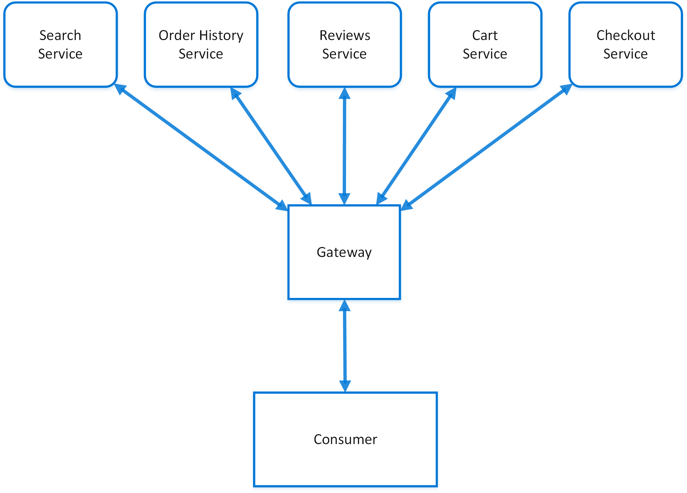

# Gateway Routing Pattern

Route requests to multiple services using a single endpoint with the gateway routing pattern. This pattern is useful when you wish to expose multiple services on a single endpoint and route to the appropriate service based on the request.

## Context and Problem

When a client needs to consume multiple applications and services, setting up an endpoint for each of the services and having the client consumer manage each endpoint can be challenging.

For example, a client application may need to communicate with any number of services to facilitate the application's capabilities. An e-commerce application could provide services such as search, reviews, cart, checkout, and order history, each of which provide a different interface that the client must interact with.

A client application that depends on multiple services such as those above must know about each endpoint in order to connect to those services or endpoints. If a change or upgrade is required to any endpoint that the client requires, the client must also be updated to reflect the change to the endpoint. If a service must be split, the code must change at both the service and the consumer side, increasing complexity when refactoring services.

## Solution

Place a gateway in front of a set of applications, services or deployments and use context in the request (e.g. application Layer 7) to route the request to the appropriate instances.

By implementing the gateway routing pattern, the client application only needs to know about and communicate with a single endpoint. If a service is consolidated or decomposed, the client does not necessarily require updating since it will continue making requests to the gateway instead of directly with the service. 

A gateway can allow you to abstract backend services from the clients, allowing you to keep client calls simple while enabling changes in the backend service structures behind the gateway. Client calls can be routed to whatever service or services need to handle the expected client behavior, allowing you to add, split, or otherwise reorganize services behind the gateway without requiring any changes to the consumer.


 
The gateway routing pattern can also assist with deployment by allowing you to manage how updates are rolled out to users without needing to modify the endpoints clients access. When a new version of your service is deployed, it can be deployed in parallel with the existing version. Gateway routing allows you to manage what version of the service is presented to the clients. This allows you to use whatever release strategy you want, performing incremental, parallel, or complete rollouts of updates. Any issues discovered after the new service is deployed can be quickly reverted by making a configuration change at the gateway without affecting clients.

## Issues and Considerations

When you are deploying the gateway routing pattern, consider the following points:

- The gateway service may introduce a single point of failure. Ensure it is properly designed to accommodate the necessary availability requirements of your application. Consider resiliency and fault tolerance capabilities when implementing.
- The gateway service may introduce a bottleneck. Ensure the gateway has adequate performance to handle load and can easily scale in line with your growth expectations.
- Perform load testing against the gateway to ensure you don't introduce cascading failures for services.
- Gateway routing is level 7. It can be based on IP, port, header, or URL.

## When to Use this Pattern

Use this pattern when:

- A client needs to consume multiple services that can be accessed behind a gateway.
- You wish to simplify client applications by using a single endpoint.
- When you need to route requests from externally addressable endpoints to internal virtual endpoints, such as exposing ports on a VM to cluster virtual IP address.

This pattern may not be suitable:

- When you have a simple application that uses only one or two services.

## Example

Using Nginx as the router, the following is a simple example configuration file for a server that routes requests for applications residing on different virtual directories to different machines at the back end.

```
server {
    listen 80;
    server_name domain.com;

    location /app1 {
        proxy_pass http://10.0.3.10:80;
    }

    location /app2 {
        proxy_pass http://10.0.3.20:80;
    }

    location /app3 {
        proxy_pass http://10.0.3.30:80;
    }
}
```

## Related guidance

- Gateway Offload
- Gateway Aggregator
- Backend for Frontends


